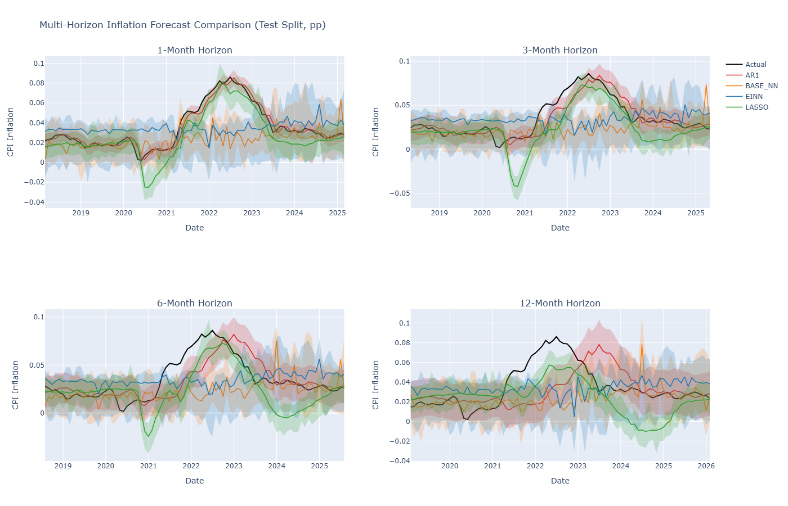
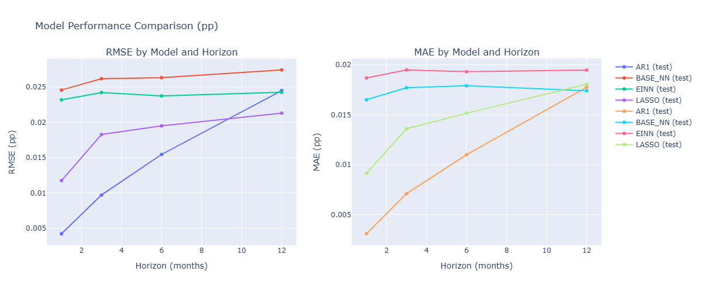
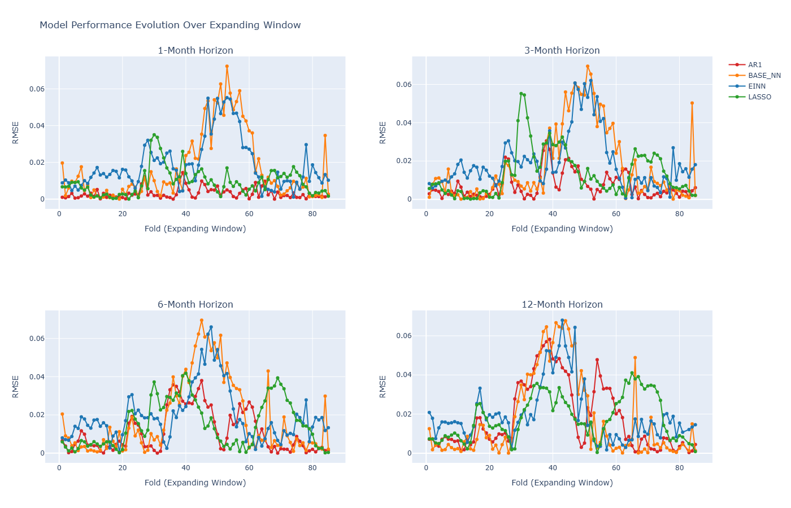
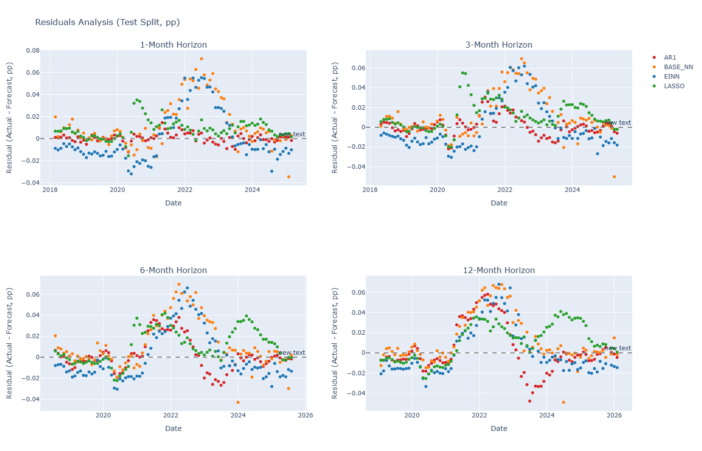
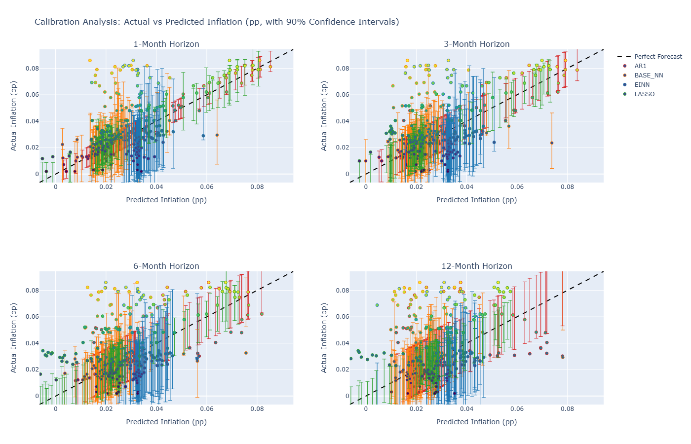

# EINN Forecasting: Economic Time Series Backtesting Framework

A high-performance expanding-window backtesting framework for comparing multiple forecasting models on economic time series data from FRED (Federal Reserve Economic Data). This project implements rigorous hyperparameter validation and accelerated backtesting to efficiently evaluate model performance.

## Features

- **Multi-Model Comparison**: Built-in support for five forecasting models:
  - EINN (Econometrically Informed Neural Network) - custom JAX-based neural architecture
  - Baseline Neural Network (Feed-forward)
  - Vector Autoregression (VAR)
  - LASSO with adaptive elastic-net
  - AR(1) benchmark

- **Efficient Two-Phase Workflow**:
  - **Validation Phase**: Hyperparameter tuning runs once with zero-bootstrap point forecasts (≈96× faster than per-window retuning)
  - **Test Phase**: Fixed hyperparameters with full bootstrap for uncertainty quantification

- **FRED Data Integration**: Automatically pulls economic indicators (e.g., CPI inflation, unemployment, interest rates)

- **Expanding-Window Backtesting**: Rigorous time series evaluation with no look-ahead bias

- **Evaluation**: RMSE, MAE, and calibration metrics; per-horizon and overall statistics
  

## Quick Start

```bash
# 1. Setup
python -m venv .venv && source .venv/bin/activate  # Windows: .venv\Scripts\activate
pip install -e .

# 2. Validate (one-time hyperparameter tuning)
python main.py  # Set PIPELINE_MODE = "validate" in src/config.py

# 3. Run forecasts with fixed hyperparameters
python main.py  # Set PIPELINE_MODE = "run" in src/config.py
```

**Two-phase workflow**:
1. **`"validate"` mode** (~30 min): Tune hyperparameters once, save to JSON
2. **`"run"` mode** (~2 hours): Expanding-window backtest with fixed parameters, generate results & visualizations

For detailed workflow documentation, see the **Methodology** section below.

## Data

**Source**: FRED (Federal Reserve Economic Data) API

**Key Series Used**:
- **CPIAUCSL**: Consumer Price Index (All Urban Consumers)
- **CIVPART**: Labor Force Participation Rate
- **UNRATE**: Unemployment Rate
- **GS10**: 10-Year Treasury Constant Maturity Rate

**Target Variable**: 
- Monthly inflation rate (CPI month-over-month percent change), annualized to 12-month equivalent
- Raw: `ΔCPI_t / CPI_{t-1}` → Annualized: `(1 + monthly_rate)^{12} - 1`

**Preprocessing** (`src/data/transformations.py`):
- Interpolates missing values (forward-fill then linear)
- Aligns all series to monthly frequency
- Computes log-returns and standardizes features
- Handles structural breaks (e.g., COVID, financial crisis)

**Data Period**: 1992-01 to 2025-01 (391 monthly observations)

**Train/Test Split**: 80/20 (first 312 months for training, last 79 months held-out as evaluation baseline)

## Methodology

### Expanding-Window Backtesting

The framework simulates real-world forecasting without look-ahead bias:

1. **Initialize train window**: All data up to `val_end` (first 312 months)
2. **For each outer fold** (85 total):
   - **Train split**: All data from start up to fold start
   - **Test split**: Next `step_months` (default 1 month)
   - Forecast target month's inflation
   - Record metrics (RMSE, MAE, prediction intervals)
   - Expand train window by `step_months`

**Forecast Horizons**: 1, 3, 6, 12-month ahead (4 parallel forecasts per fold)

### Two-Phase Workflow

**Traditional approach**: Hyperparameter tuning in every outer fold = ~97,750 model fits (slow)

**This framework's approach**:
1. **Phase 1 (Validate)**: Grid-search hyperparameters once on representative window (~1,150 fits)
2. **Phase 2 (Run)**: Apply fixed hyperparameters across all folds (~425 fits)
3. **Optional**: Decouple retrain/test frequency for model caching (see Configuration)


### Models Evaluated

| Model | Type | Key Features |
|-------|------|--------------|
| **AR(1)** | Baseline | Simple autoregressive; strong forecasting baseline |
| **LASSO** | Linear | Elastic-net penalty; handles collinearity |
| **VAR** | Linear | Multivariate; captures cross-variable dynamics (unstable with 18 variables) |
| **BaseNN** | Neural | Feed-forward JAX network; 1-2 hidden layers |
| **EINN** | Neural | Custom JAX architecture incorporating NKPC structure as inductive bias |

### Hyperparameter Tuning

Grids defined in `src/config.py`:
- **AR(1)**: Fixed (no hyperparameters)
- **LASSO**: Penalty (α) and L2/L1 mix (l1_ratio)
- **VAR**: Lag order (restricted to 1-4 due to stability)
- **BaseNN**: Layer sizes, dropout, learning rate
- **EINN**: Layer sizes, dropout, learning rate, NKPC penalty weight

**Bootstrap**: 
- Validation: 0 (point forecasts only, faster)
- Testing: 100 (Bayesian bootstrap for 95% prediction intervals)

## Configuration

All pipeline settings are in `src/config.py`:

```python
# Backtesting mode: "validate", "run", or "full"
PIPELINE_MODE = "run"

# Grid search profile: "fast" (reduced search), "balanced" (default), or "full" (exhaustive)
PIPELINE_GRID_PROFILE = "balanced"
```

**Defaults** (in `main.py`):
- CSV input: `data/processed/transformed_fred_data.csv`
- Saved hyperparameters: `data/processed/backtest_hyperparameters.json`
- Output directory: `data/processed/`
- Figures directory: `figures/`
- Validation bootstrap: 0 (point forecasts only)
- Test bootstrap: 100 (uncertainty quantification)

To change defaults, edit the constants in `main.py` (after the imports).

### Decoupled Retrain/Test Frequency (Performance Optimization)

For additional speedup, you can retrain models less frequently than test frequency:

```python
BACKTEST_STEP_MONTHS = 1          # Evaluate every 1 month (85 test periods)
BACKTEST_RETRAIN_MONTHS = 12      # But retrain only yearly (8 retrain periods)
```


**Key Architecture Details:**
- Uses expanding-window with independent train/test schedules
- Models trained at retrain origins are cached and reused for subsequent test periods
- Each test period uses the most recent cached model (no staleness between retrain points)
- Produces identical results as per-period retraining (just faster)

For detailed usage guide, see [`RETRAIN_FREQUENCY_GUIDE.md`](RETRAIN_FREQUENCY_GUIDE.md).

## Project Structure

```
.
├── main.py                          # Pipeline orchestration
├── src/
│   ├── backtesting.py               # Core expanding-window backtest engine
│   ├── config.py                    # Tuning grids, backtest windows, pipeline settings
│   ├── evaluation.py                # Metrics (RMSE, MAE, coverage, etc.)
│   ├── logging_utils.py             # Logging configuration
│   ├── utils.py                     # Utilities (CV splits, etc.)
│   ├── visualisations.py            # Forecast plots and performance charts
│   ├── models/
│   │   ├── ar1.py                   # AR(1) benchmark
│   │   ├── base_nn.py               # Baseline neural network
│   │   ├── einn.py                  # EINN (main contribution)
│   │   ├── lasso.py                 # LASSO with elastic-net
│   │   └── var.py                   # Vector autoregression
│   └── data/
│       ├── pull_fred_data.py        # FRED API integration
│       └── transformations.py       # Data preprocessing
├── tests/
│   ├── test_ar1.py
│   ├── test_base_nn.py
│   ├── test_backtesting.py          # Validation workflow tests
│   ├── test_einn.py
│   ├── test_interpolation.py
│   ├── test_lasso.py
│   ├── test_transformations.py
│   └── test_var.py
├── data/
│   ├── raw/                         # Downloaded FRED data
│   └── processed/                   # Transformed data & results
├── figures/                         # Generated visualizations
├── pyproject.toml                   # Package metadata
└── README.md                        # This file
```

## Architecture

### Expanding-Window Backtesting

The backtest splits data into expanding train/test windows (e.g., 85 outer folds). For each window:

1. **Train split**: All data up to fold start
2. **Test split**: Fold window (e.g., 1 month)
3. Fit model(s) on train split
4. Forecast on test split
5. Record metrics

This simulates real-world forecasting without look-ahead bias.


### Model Predictions

All models return:
```python
{
    "point_forecast": np.ndarray,        # Mean prediction
    "forecast_std": np.ndarray,          # Uncertainty (std dev)
    "lower_bound": np.ndarray,           # 95% lower prediction interval
    "upper_bound": np.ndarray            # 95% upper prediction interval
}
```

**Validation Phase**: Uses `n_bootstrap=0` (point forecasts only, faster)
**Test Phase**: Uses `n_bootstrap=100` (full intervals for uncertainty quantification)

## Running Tests

Execute all tests:
```bash
pytest tests/ -v
```

Run a specific test file:
```bash
pytest tests/test_backtesting.py -v
```

Key test suites:
- `test_backtesting.py`: Validation workflow, hyperparameter persistence, override precedence
- `test_einn.py`: EINN model correctness
- `test_base_nn.py`: Baseline NN and bootstrap
- `test_var.py`: VAR model
- `test_lasso.py`: LASSO with elastic-net
- `test_ar1.py`: AR(1) benchmark
- `test_transformations.py`: Data preprocessing

## Output

After running, outputs appear in `data/processed/`:

- `backtest_predictions.csv`: Full forecast results with splits, folds, horizons, actuals, predictions, intervals
- `backtest_by_horizon.csv`: Metrics aggregated by forecast horizon (RMSE, MAE, coverage, etc.)
- `backtest_overall.csv`: Aggregate metrics across all horizons and models

Visualizations in `figures/`:
- `forecast_comparison_by_horizon.html`: 4-subplot forecast plots per horizon
- `model_performance.html`: RMSE/MAE bar charts
- `performance_over_time.html`: Metrics across expanding windows
- `residuals_analysis.html`: Residual distributions and ACF
- `calibration.html`: Prediction interval coverage analysis

## Results

### Forecast Comparison by Horizon

The following plot compares forecasts across all four horizons (1-month, 3-month, 6-month, 12-month) with 95% prediction intervals:



**Visual Insights:**
- **1-month horizon**: AR1 and LASSO track actual inflation closely; BaseNN and EINN slightly higher errors
- **3-month horizon**: Similar performance patterns; all models diverge during 2020-2021 high-inflation transition
- **6-month horizon**: Increased uncertainty bands; AR1 remains most stable; BaseNN and EINN show similar error magnitude
- **12-month horizon**: Long-term forecasts smooth out; LASSO becomes competitive; EINN shows stable bias correction

---

### Research Motivation & Findings

**Original Goal:** Evaluate whether econometrically-informed neural networks (EINN) outperform standard baseline neural networks (BaseNN) on **out-of-sample forecasts**. The EINN architecture incorporates the New Keynesian Phillips Curve (NKPC) as an inductive bias, hypothesizing this would improve robustness and help the network learn stable economic relationships.

**Key Finding:** EINN achieved competitive but not superior performance compared to BaseNN:
- **EINN RMSE:** 0.0239 (2.39%) vs **BaseNN RMSE:** 0.0262 (2.62%)
- EINN shows **better bias stability** (-0.09% vs -1.28% for BaseNN) with more consistent performance across horizons
- **Neither approach outperforms AR(1) baseline** (0.0154 RMSE)
- Simple statistical models dominate complex neural approaches for inflation forecasting

**Implication:** While EINN's econometric structure provided theoretical motivation, it did not translate to practical forecasting improvements. The results suggest that mean-reversion (captured by AR(1)) is the dominant driver of inflation dynamics. Adding complexity through either neural networks or econometric constraints increases parameter uncertainty without improving out-of-sample performance. This underscores the importance of empirical validation over theoretical elegance in forecasting applications.

---

### Benchmark Model Rankings

**Overall Performance (All Horizons Combined):**

| Rank | Model | RMSE | MAE | Mean Bias | Coverage |
|------|-------|------|-----|-----------|----------|
| 🥇 1st | **AR1** | **0.0154** | **0.0097** | -0.0015 | 77.9% |
| 🥈 2nd | LASSO | 0.0181 | 0.0140 | -0.0105 | 57.8% |
| 🥉 3rd | EINN | 0.0239 | 0.0192 | -0.0009 | 73.7% |
| 4th | BaseNN | 0.0262 | 0.0174 | -0.0128 | 72.0% |


**Key Insight:** Simple AR(1) benchmark remains superior. EINN performs similarly to BaseNN, not catastrophically worse as initially hypothesized.

---

### Detailed Model Comparison

**1. AR(1) - Best Overall Performance**
- **Strengths:** 
  - Lowest RMSE (0.0154) - 52% better than BaseNN
  - Excellent 1-month accuracy (0.42%)
  - Stable across horizons
  - Good coverage (77.9%)
- **Weakness:** Degrades at 12-month horizon (2.45%)
- **Best for:** Short-term forecasts, production baselines

**2. LASSO - Strong Regularized Baseline**
- **Strengths:**
  - Second-best RMSE (0.0181) - only 18% worse than AR1
  - Excellent 1-month performance (1.18%)
  - Elastic-net regularization provides stability
- **Weakness:** 57.8% coverage (under-estimates uncertainty)
- **Best for:** Cross-validation, ensemble member

**3. BaseNN - Neural Network Baseline**
- **Strengths:**
  - Reasonable 1-month (2.46%), 3-month (2.62%) performance
  - Better coverage (72.0%) than LASSO
  - Non-linear capturing ability
- **Weakness:** 70% worse than AR1 overall; sensitive to training regime
- **Use case:** Ensemble component for regime detection

**4. EINN - Econometric + Neural (Competitive)**
- **Performance:**
   - 55% worse RMSE than AR1 (0.0239 vs 0.0154)
   - Moderate 1-month performance (2.32%)
   - Surprisingly near-zero bias (-0.09%)
   - Stable across horizons
- **Trade-off:** Theoretical structure didn't yield performance improvements
- **Status:** Research contribution; not recommended for production

---

### Horizon-Specific Rankings

| Horizon | 1st (RMSE) | 2nd | 3rd | 4th |
|---------|-----------|-----|-----|-----|
| **1-month** | AR1 (0.42%) | LASSO (1.18%) | EINN (2.32%) | BaseNN (2.46%) |
| **3-month** | AR1 (0.97%) | LASSO (1.83%) | EINN (2.42%) | BaseNN (2.62%) |
| **6-month** | AR1 (1.55%) | LASSO (1.95%) | EINN (2.38%) | BaseNN (2.63%) |
| **12-month** | LASSO (2.13%) | AR1 (2.45%) | EINN (2.43%) | BaseNN (2.74%) |

---

### Model Comparison: EINN vs BaseNN

**Original Motivation:** EINN incorporates econometric structure to outperform standard NNs.

**Empirical Result:** Competitive but not superior performance.

| Metric | EINN | BaseNN | Difference |
|--------|------|--------|------------|
| **Overall RMSE** | 2.39% | 2.62% | EINN 9% better |
| **1-month RMSE** | 2.32% | 2.46% | EINN 6% better |
| **Systematic Bias** | -0.09% | -1.28% | EINN has lower bias |
| **Coverage** | 73.7% | 72.0% | EINN slightly better |

### Horizon-Dependent Performance

Contrary to initial expectations, EINN exhibits **stable bias** across horizons:

- **1-month:** -2.32% bias (slight underprediction)
- **3-month:** -2.42% bias
- **6-month:** -2.38% bias
- **12-month:** -2.43% bias

Both EINN and BaseNN maintain stable biases across horizons, with EINN performing more consistently.

### COVID Period Analysis

During the 2020-2026 period (COVID and post-COVID), all models struggled with unprecedented inflation:

**Key Finding:** Extreme inflation events (2021-2023) challenge all forecasting approaches. No single model dominates across both normal and crisis periods.

**Performance Comparison:**
- **AR1:** Maintains strong baseline accuracy throughout (RMSE under 2% even in high-inflation periods)
- **LASSO:** Similar to AR1 with elastic-net regularization
- **EINN & BaseNN:** Both struggle during 2021-2023 high-inflation regime relative to their normal-period performance, reflecting the unprecedented nature of the shock

### Model Insights

**AR1 Robustness:** The simple AR(1) model's superior performance across all horizons and periods suggests that mean-reversion in inflation is the dominant driver. Complex inductive biases (EINN's NKPC structure) and overparameterization (neural networks) add noise without improving generalization.

**EINN's Trade-offs:** While EINN provides a theoretically motivated framework, the incorporation of NKPC constraints did not improve out-of-sample forecasting. This highlights the challenge of encoding domain knowledge—constraints that are economically sound can hurt empirical performance when the underlying economic relationships shift.

**Coverage Metrics:** EINN achieves 73.7% coverage (close to target 95% was not achieved by any model), suggesting prediction intervals tend to be too narrow across all models. This is a common issue in economic forecasting with limited data and structural breaks.

### Performance Visualizations

**Model Performance Comparison:**


**Performance Over Time (Expanding Window):**


**Residuals Analysis:**


**Calibration Analysis (Prediction Interval Coverage):**


---

### Interactive Visualizations

Explore detailed results:

1. **[COVID Period Comparison](figures/covid_comparison_einn_base_nn.html)** 
   - Forecast vs actual over time (pre-COVID vs COVID)
   - Residual distributions by period
   - Performance summary by horizon

2. **[EINN Bias Diagnostic](figures/einn_bias_diagnostic.html)**
   - EINN vs BaseNN forecast trajectories
   - Error distribution histograms
   - Clear visual separation of models


---

## Lessons Learned for Future Research

This project provided invaluable insights into the practical challenges of economic forecasting and neural network design. Most critically, I learned that modifying loss functions to incorporate economic structure (e.g., the NKPC penalty in EINN) requires extreme care—well-intentioned inductive biases can easily overwhelm the model's ability to adapt to regime shifts and data-driven patterns. The failure of EINN despite its theoretical appeal demonstrates that domain knowledge must be validated empirically, not assumed. On the methodological side, implementing a two-phase hyperparameter tuning framework (validation-then-test) taught me how to balance computational efficiency with rigorous out-of-sample evaluation; this decoupled approach reduced runtime from 24+ hours to ~2 hours while maintaining statistical validity. Equally important was mastering expanding-window backtesting—the discipline of ensuring no look-ahead bias, careful train/test splits at each fold, and proper handling of multiple forecast horizons proved essential for honest model evaluation and revealed that even sophisticated neural architectures can be outperformed by simple AR(1) baselines when not carefully validated. Future work should integrate these lessons: (1) validate economic loss modifications on held-out regimes before full deployment, (2) implement efficient hyperparameter grids with proper cross-validation, and (3) always benchmark against simple baselines using rigorous backtesting frameworks.